# 陈淯培的作品展示

## 目录
>   
> 1. [O-Lab创享会社团网站](#first)
> 2. ["北冥有鱼"水下机器人Web端网页](#second)
> 3. ["帮你决策"微信小程序设计](#third)
> 4. ["基于PIC的智能滑板车设计"中的移动端软件](#fourth)
>   

### 1. O-Lab创享会社团网站[https://oucolab.cn](https://oucolab.cn)
1. **截图**
    

        

            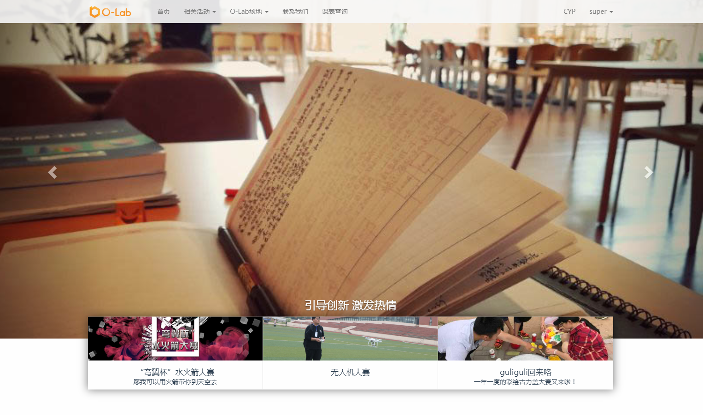
        

        
        
            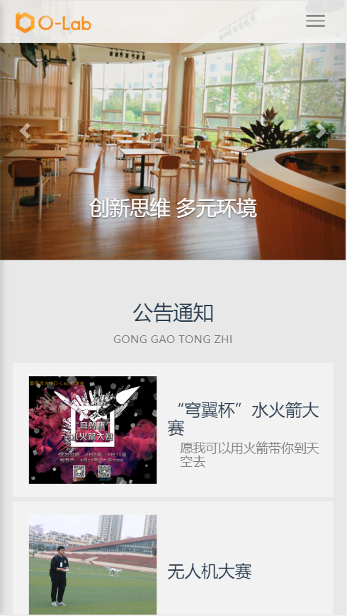
        
        
    
    
    
主页

    
    

        

            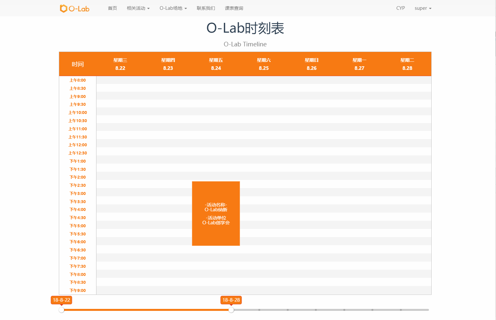
        

        
        
            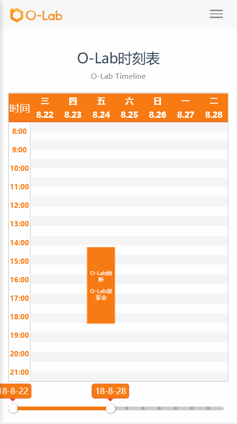
        

    

    
时刻表

    

        

            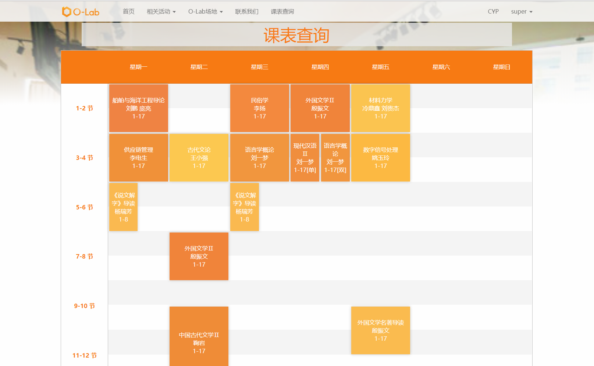
        

        
        
            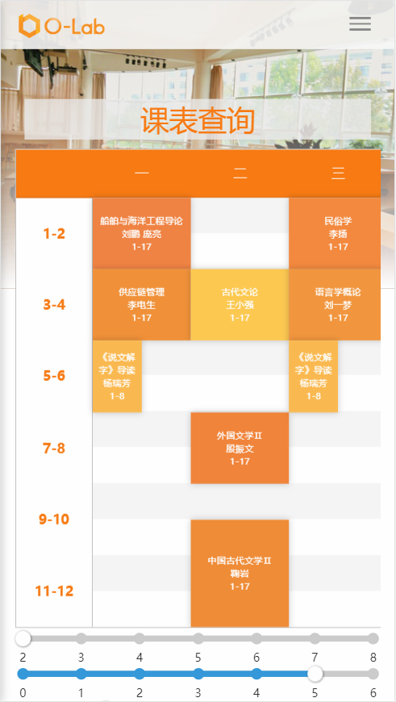
        

    

    
课表查询

    

        

            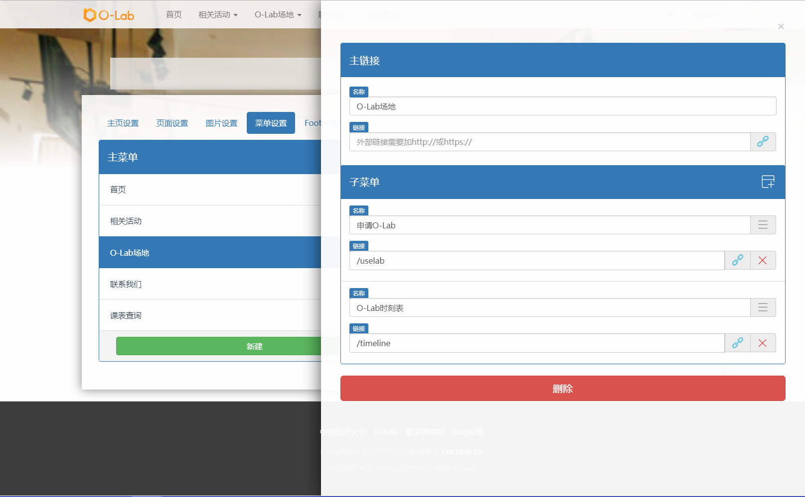
        

        
        
            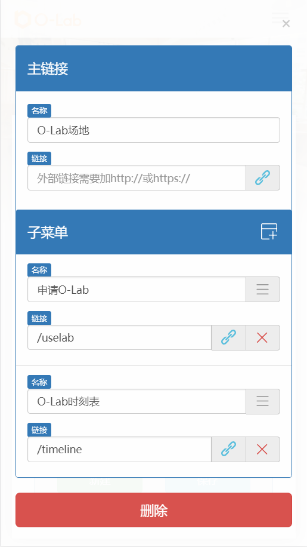
        

    

    
菜单设置

    

        

            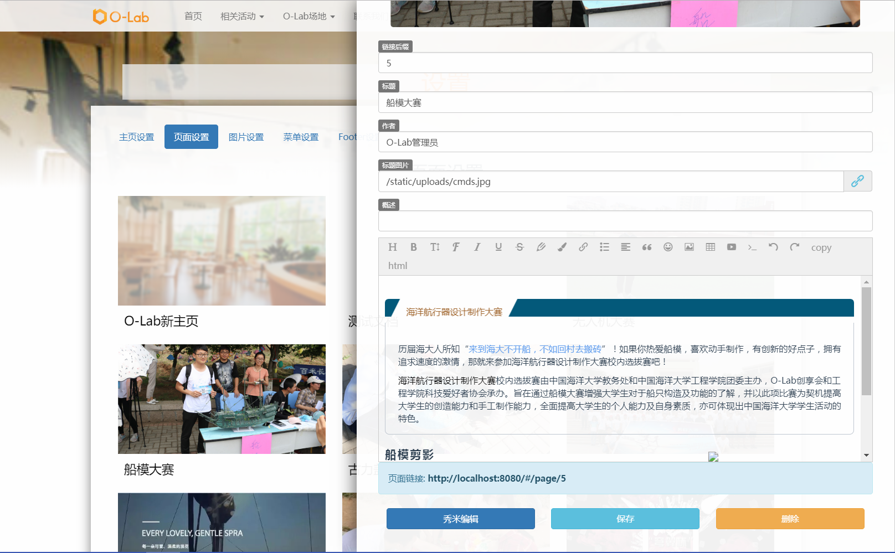
        

        
        
            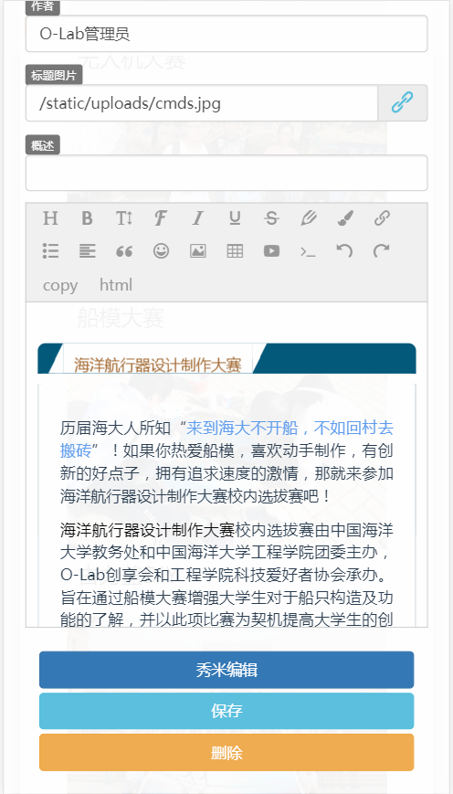
        

    

    
页面编辑
    
2. **介绍**
    * 本作品是O-Lab社团的网站。网站主要展示了社团最近的活动以及社团活动室的使用情况。为了方便没有编程基础的人操作后台网站，后台设计了一个富文本的编辑系统，接入秀米以实现与微信编辑一样的文本编辑操作。同时网站还集成了社团活动室的申请系统，校内人员可以通过提交申请的方式将社团使用申请提交至网站，网站通过自动计算来改变社团活动室的使用情况并实时进行展示，同时后台也有审核的系统。并且网站还有海洋大学校内的课表查询，可以查询到校内所有教室的上课使用情况。本作品采用扁平化、现代化的设计方式，并且响应式地适配了手机端和电脑端的布局。并且网站使用了微信登录方式，增加用户安全性。
3. **技术栈**
    * **前端**： vue vue-router vuex bootstrap axios sass ...
    * **后端**： Nginx PHP _(ThinkPHP5.1)_ &nbsp;&nbsp;MySql wkhtmltopdf _(生成申请表用)_&nbsp;&nbsp;Node.js _(爬取教务处课表用)_
4. **关于**
    * **开发者：** 陈淯培
    * **个人参与时间：** 2017/5 - 2018/8 _(已经交接给下一届)_
    * **github:** [https://github.com/yphub/olab](https://github.com/yphub/olab)

### 2. "北冥有鱼"水下机器人Web端网页
1. **截图**
    

        
    
            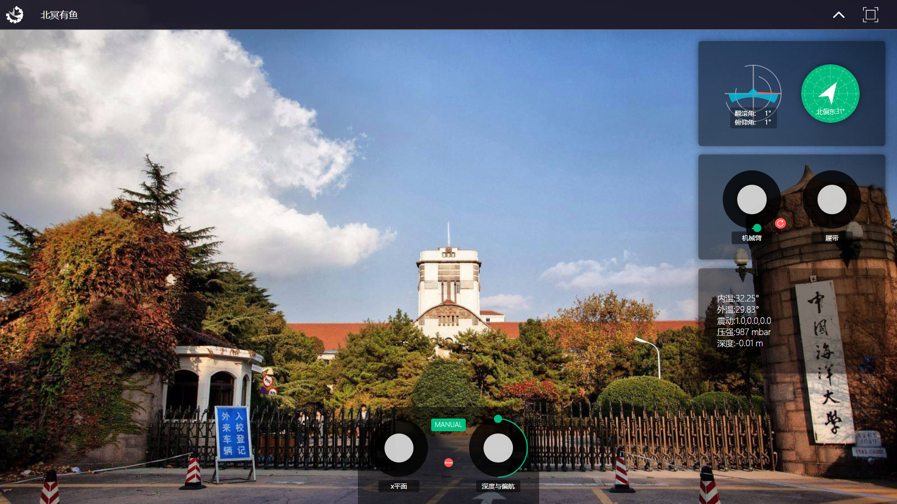            
            
主页

        

        
    
            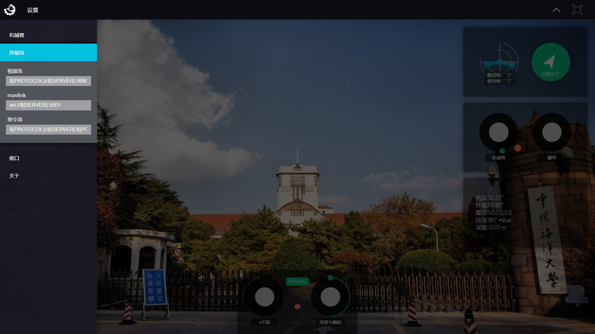            
            
设置

        

        
    
            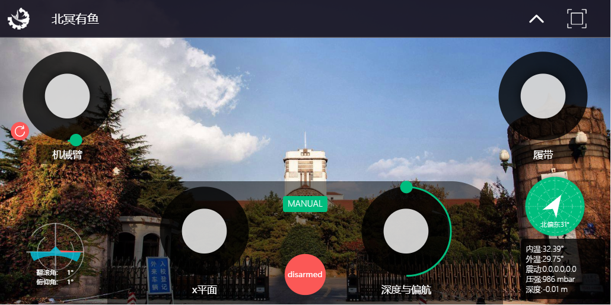            
            
移动端

        

    

2. **介绍**
    * 本作品是“北冥有鱼”水下机器人的上位机Web端页面。该页面使用原生[WebSocket]()以及[Socket.io]()实现上下位机的双工通讯，其中[WebSocket]()主要负责mavlink指令的传输，[Socket.io]()主要负责传感器、机械臂、履带指令的传输。背景在无视频流的情况下是默认背景，有视频流的情况是水下机器人的正前摄像头视角。该页面集成了键盘控制、手柄控制，以及移动端的适配功能。其中手柄遥感、陀螺仪与罗盘是直接结合Vue与原生DOM自行编写而成，没有套用外部组件。所有控制组件可以通过开关进行隐藏显示，配合[@media]()布局提高屏幕适应性。整体页面及功能(包括下位机服务端程序)由本人独立完成。
3. **技术栈**
    * **前端：** vue vuex vue-socketio WebSocket _(原生)_ &nbsp;sass
    * **后端：** Node.js _(koa ws koa-socketio 原生UDP)_ &nbsp;Python _(pymavlink 原生UDP)_
4. **关于**
    * **开发者：** 陈淯培
    * **其他组员：** 安树坤、刘健钊、李志强、陈志伟、赵宏琳
    * **时间：** 2018/5 - 2018/8
    * **github：** [https://github.com/yphub/BMGC](https://github.com/yphub/BMGC)

### 3. "帮你决策"微信小程序设计
1. **截图**
    

        

            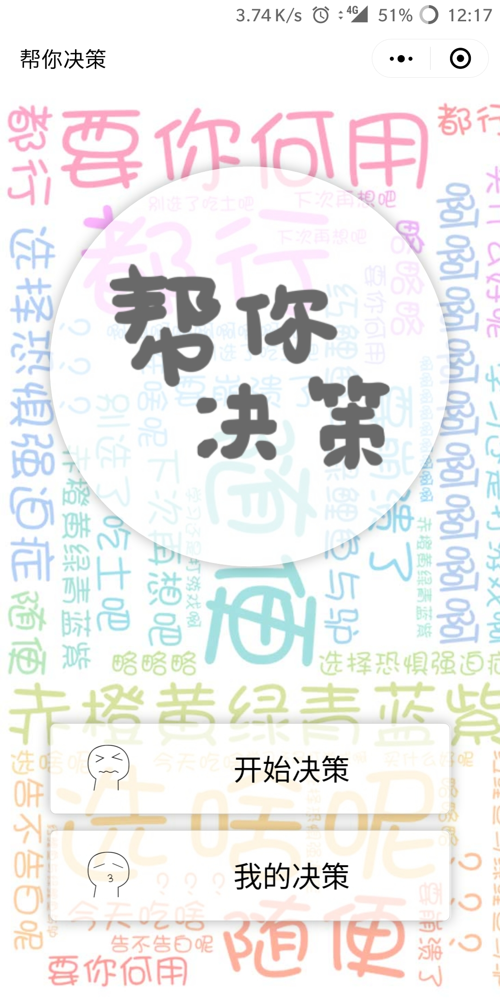
            
主页

        

        

            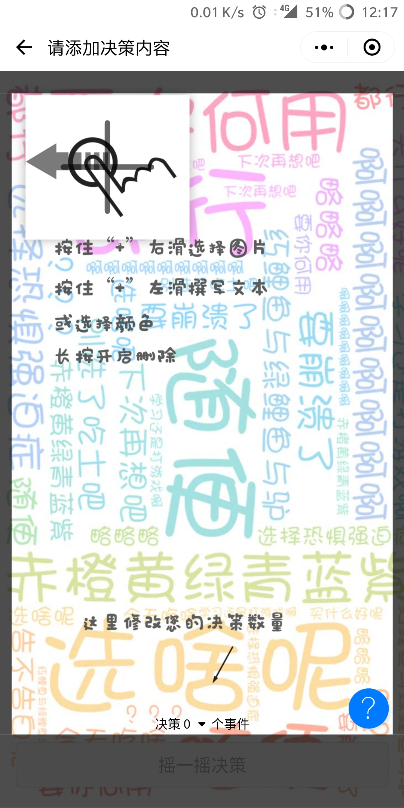
            
向导

        

        

            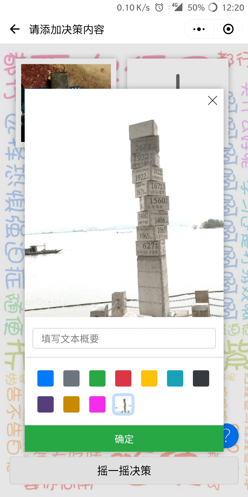
            
选择

        

        

            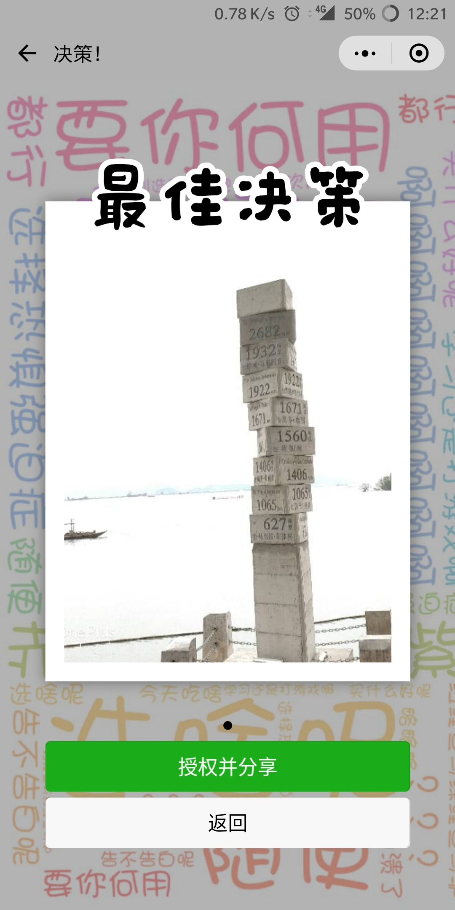
            
结果

        

        

            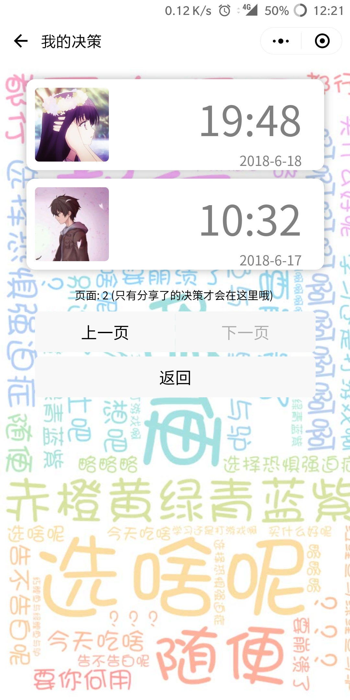
            
我的

        

    

2. **介绍**
    * 本作品是微信小程序“帮你决策”的前端部分，使用[mpvue]()框架编写。由于[mpvue]()不支持vue有的[transition]()特性(小程序框架限制)，本人将[display]()与[transition]()整合至组件中，实现动画效果。
3. **技术栈**
    * **前端：** mpvue vuex sass
    * **后端：** Nginx Node.js _(koa koa-multer koa-session2 sequelize axios)_&nbsp; mysql
4. **关于**
    * **开发者：** 陈淯培、古良辉
    * **其他组员：** 刘颜郡    
    * **时间：** 2018/4 - 2018/6
    * **github：**[https://github.com/yphub/whats-your-decision](https://github.com/yphub/whats-your-decision)

### 4. "基于PIC的智能滑板车设计"中的移动端软件
1. **截图**
    

        

            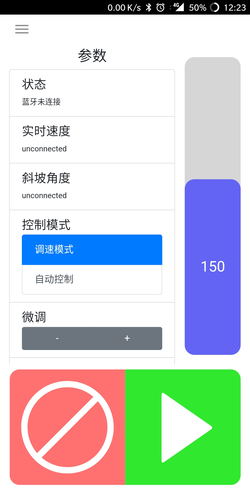
            
控制台

        

        

            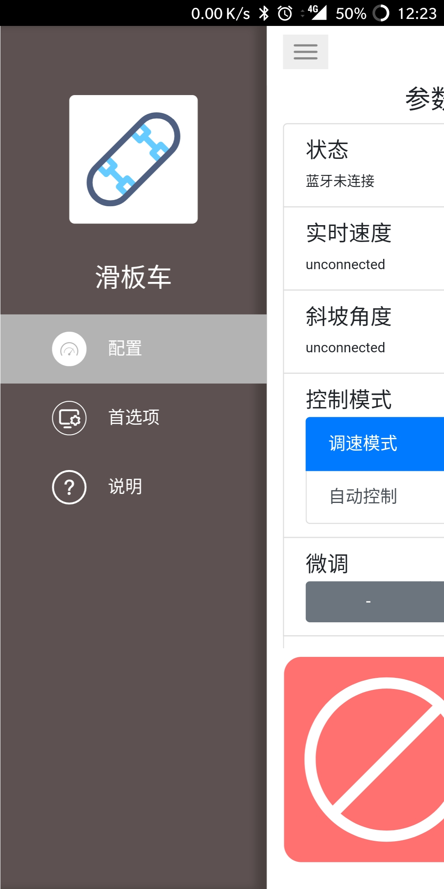
            
菜单

        

    

2. **介绍**
    * 本作品是为智能滑板车控制设计的移动端软件界面，软件打包后为apk文件，即[Android]()端软件。界面主要采用了[Cordova]()框架，以[HTML/CSS/JS]()的形式编写界面，然后在[Android]()端封装为[WebView Activity](),并将UI接口暴露给[Java]()供数据传输用。前端主要还是沿用了[Vue]()框架，然后将蓝牙接口中间化，再通过[Java]()进行封装。在[Java]()中，实例化了独立的[Thread]()进行蓝牙的[InputStream]()与[OutputStream]()操作。
3. **技术栈**
    * **UI：** Cordova vue vuex sass
    * **Java：** Android SDK _(Thread BluetoothDevice BluetoothSocket JSONObject JSONArray)_ &nbsp;&nbsp;Cordova _(CordovaWebViewEngine)_
4. **关于**
    * **开发者：** 陈淯培
    * **其他组员：** 李海宁、高鹏、黄鸿宇
    * **时间：** 2017/05 - 2018/04